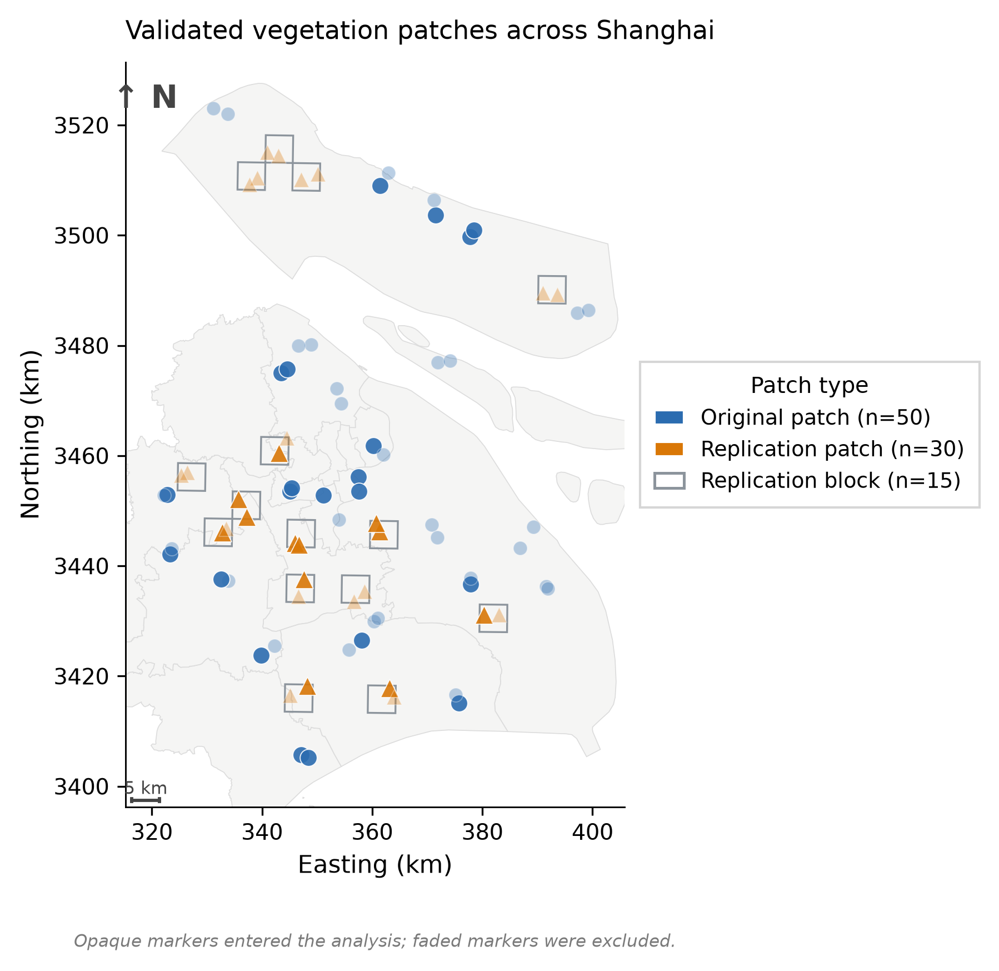
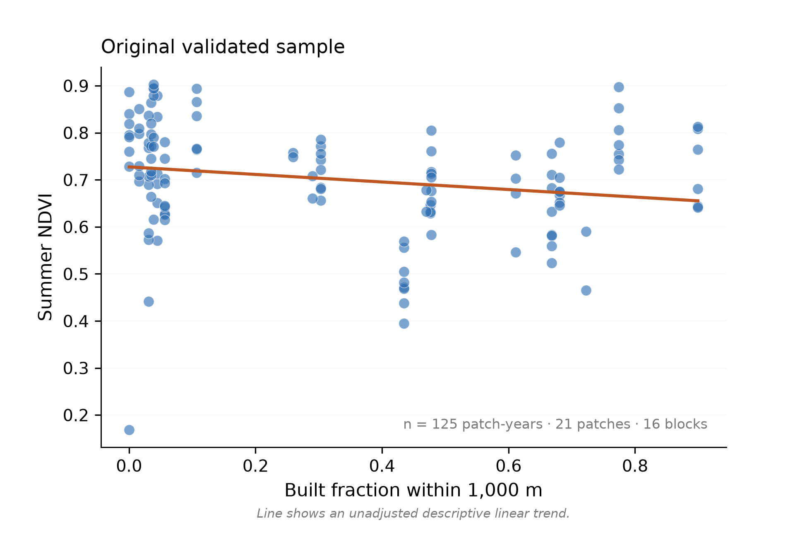
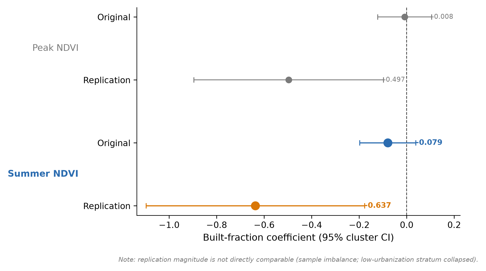
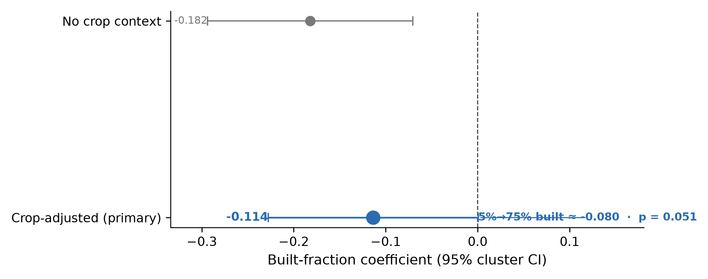
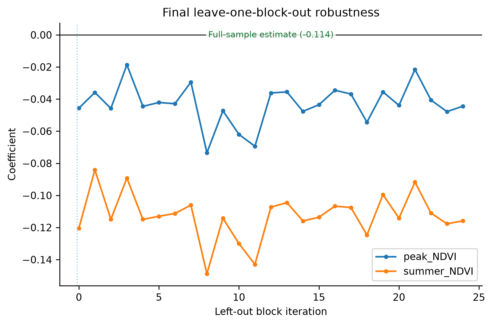
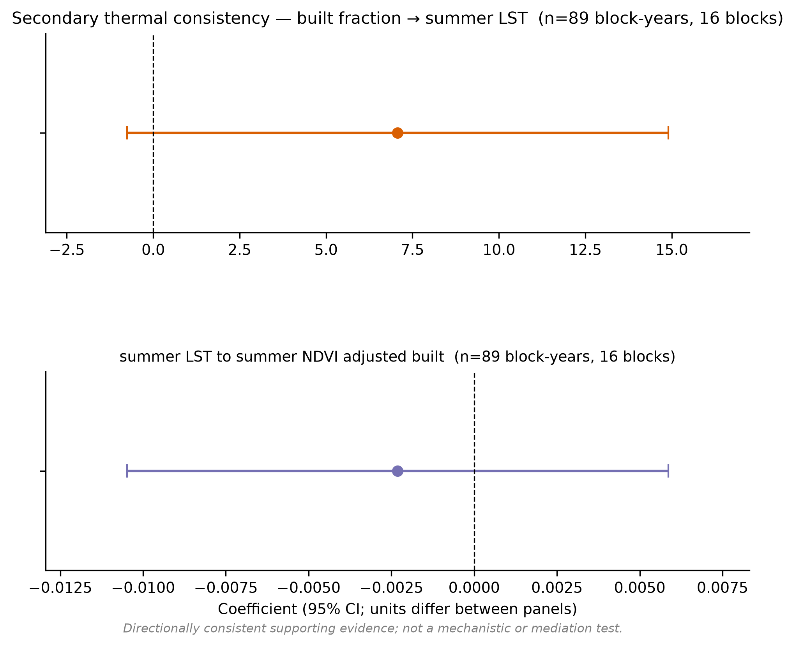

# Shanghai Urbanization and Summer Vegetation Greenness

A multi-sensor remote-sensing study of how surrounding urbanization intensity is associated with summer vegetation greenness across Shanghai tree and grass patches from 2017 to 2025.

## Research question

How is surrounding urbanization intensity associated with summer vegetation greenness across Shanghai?

## Study design

The study covers Shanghai over 2017–2025. Vegetation is represented by 25 originally sampled 5 km blocks (50 tree/grass candidate patches) plus an independent replication of 15 new blocks. In each block we characterize the surrounding built environment with a patch-level built fraction computed within a 1,000 m radius. Summer greenness is the median valid NDVI during July–August; peak greenness (90th-percentile March–November NDVI) is treated as a secondary endpoint. Satellite data come from Sentinel-2 L2A and Landsat Collection 2 Level-2, cross-calibrated and combined at the patch-year level.



## Data

| Layer | Source | Period |
|---|---|---|
| Surface reflectance (10/30 m) | Sentinel-2 L2A (Microsoft Planetary Computer STAC) | 2017–2025 |
| Surface reflectance (30 m) | Landsat Collection 2 Level-2 | 2017–2025 |
| Built / land cover | ESA WorldCover; IO LULC annual | 2017–2023 |
| Urbanization gradient | Built fraction within 1,000 m of each patch | — |

Raw imagery and large intermediate rasters are not included in the repository; see `data/README.md` and `docs/data_sources.md` for sources, versions, and acquisition.

## Methods

The analysis proceeds as a single fixed pipeline:

1. **Urbanization gradient** — built fraction per patch at 1,000 m, with 90 m kept only for sensitivity.
2. **Vegetation patch validation** — all 50 original patches were independently audited against historical imagery, blinded to NDVI outcomes; 21 persistent, clearly typed tree/grass patches entered the validated sample.
3. **Multi-year NDVI extraction** — Sentinel-2 and Landsat observations are extracted per patch-year under fixed temporal QC rules and combined with platform-aware calibration.
4. **Block-aware statistics** — patch-year OLS with errors clustered by independent 5 km block, a 1,000-replicate block bootstrap, and leave-one-block-out refits.
5. **Independent spatial replication** — an external sample of new blocks was validated and analyzed before any combined fit.

The model is `endpoint ~ built_fraction_1000m + vegetation_type + year + crop_context_1000m`. Full details are in `docs/methods.md` and `config/final_analysis.json`.

## Key results

Higher surrounding built intensity was consistently associated with lower summer vegetation greenness. This was not a single-sample result:

- In the independently validated original sample, summer NDVI was −0.079 (95% CI −0.197 to 0.039; 125 patch-years, 21 patches, 16 blocks), with all 16 leave-one-block-out estimates negative.
- An independent spatial replication reproduced the direction: summer NDVI −0.637 (cluster 95% CI −1.096 to −0.177; 74 patch-years, 12 patches, 9 blocks), with all 9 leave-one-block-out estimates negative. Its block-bootstrap interval crossed zero, and its low-urbanization stratum collapsed to a single retained block, so the magnitude is not comparable to the original sample.
- The combined crop-adjusted model (199 patch-years, 33 patches, 25 blocks) gave a summer coefficient of −0.114 (95% CI −0.228 to 0.001; p = 0.051; block bootstrap −0.249 to 0.074), with all 25 leave-one-block-out estimates negative. Moving from 5% to 75% built fraction corresponds to about −0.080 summer NDVI. A model without crop context was stronger (−0.182, 95% CI −0.294 to −0.070), showing that rural/agricultural context attenuates rather than removes the direction.



*The independent replication is summarized by its reported effect and uncertainty in the comparison below (Figure 8); the per-point replication scatter is not included in this repository because the underlying per-point NDVI table was not committed, so the figure is not regenerable from the published outputs.*





<div style="margin-top:32px"></div>



All three sensor strategies (Sentinel-2 only, pooled calibration, platform-aware calibration) returned negative summer estimates, although each confidence interval crossed zero. Peak NDVI was negative but weaker and more sensor-sensitive (combined −0.044, 95% CI −0.148 to 0.061; all 25 leave-one-block-out estimates negative) and is reported as a secondary endpoint, not a confirmatory one. Thermal evidence was directionally consistent with the main result — built fraction was positively associated with summer land-surface temperature, and summer LST negatively associated with summer NDVI — but remains a supporting secondary line of evidence.

<div style="margin-top:24px"></div>



<div style="margin-bottom:32px"></div>

**Uncertainty.** The combined block-level confidence interval and block-bootstrap interval did not fully exclude zero. The finding is therefore a reproducible, replicated *association*; it is not presented as a proven causal effect, and the remaining inferential uncertainty is substantial.

## Limitations

- Observational design: no randomization, so associations are not causal.
- Land-cover and patch purity rely on class-based products and visual validation; some peri-urban crop contamination remains.
- Cross-sensor calibration is annually unstable; Sentinel-2-only peak NDVI reverses sign, so peak is downgraded.
- Agricultural and crop context materially attenuates estimates.
- The independent replication retained only one low-urbanization block, limiting magnitude comparison.
- Thermal analysis is restricted to originally validated blocks and is secondary.

## Repository structure

```
config/        Final analysis configuration (final_analysis.json)
scripts/       Final pipeline: extraction, calibration, models, replication, figures
data/          Data-source documentation (raw data not stored here)
outputs/tables/ Final result tables (primary models, replication, LOO, calibration)
assets/figures/ Selected figures
gis/           Validated patch and replication-block geometries (GeoJSON)
docs/          methods.md, data_sources.md, limitations.md
```

## Reproducibility

Environment: Python 3.12+ with `requests`, `pandas`, `numpy`, `scipy`, `matplotlib`, `rasterio`, `pyproj` (see `requirements.txt`). The analysis is configured by `config/final_analysis.json` (random seed 42; analysis CRS EPSG:32651; display CRS EPSG:4326). The scripts in `scripts/` are the final pipeline that produced `outputs/tables/` and `assets/figures/`; they require the source imagery acquired per `docs/data_sources.md`. Result tables and figures are provided directly so the reported numbers can be inspected without re-running extraction.
